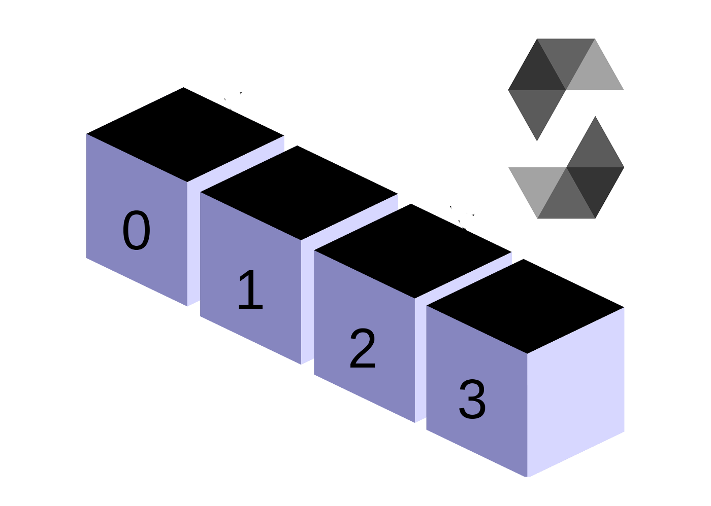

<h1 align='center'>
    

   <p align="center">
      
      
      
      
  </p>  
</h1>

  <p align="center">
  <a href="#-keepalive"> Sobre</a>&nbsp;&nbsp;|&nbsp;&nbsp;
  <a href="#-Metodos-implemenetados">  Metodos Implementados  </a>&nbsp;&nbsp;
  <a href="#-Como-rodar-a-aplicação">  Como rodar  </a>&nbsp;&nbsp;
</p>

<div align='center'>

</div>

## Rich Array

O Rich Array é um experimento com o Array do Javascript onde o mesmo foi estendido adicionando novos métodos auxiliares que são vejo sendo bastante utilizados no dia-a-dia

## 📝 Metodos implementados

- [x] Chunks - Retorna o array particionado em partes de igual quantidade cuja quantidade de itens por parte é passada por parâmetro
- [x] Clear - Limpa o array e o deixa vazio
- [x] Reversed - Retorna um novo array com os elementos em ordem reversa
- [x] Take - Extrai um numero de elementos do array sendo esse numero passado por parâmetro e os elementos extraídos sendo do inicio do array

## 👷‍♀️ Como rodar a aplicação

```bash
# Clone o projeto
$ git clone https://github.com/KiwiDev808/rich-array.git

# Rode um dos exemplos com o yarn
$ yarn example:chunks

```

---

<blockquote> Feito por Lucas Bacelar 🪐 </blockquote>
